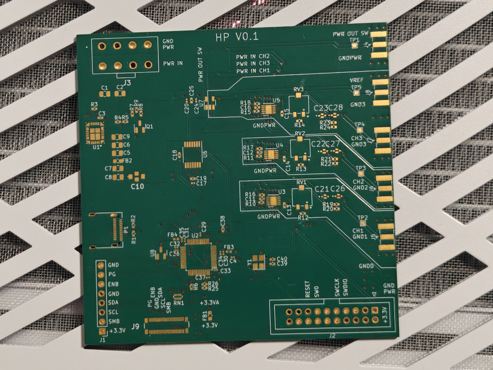
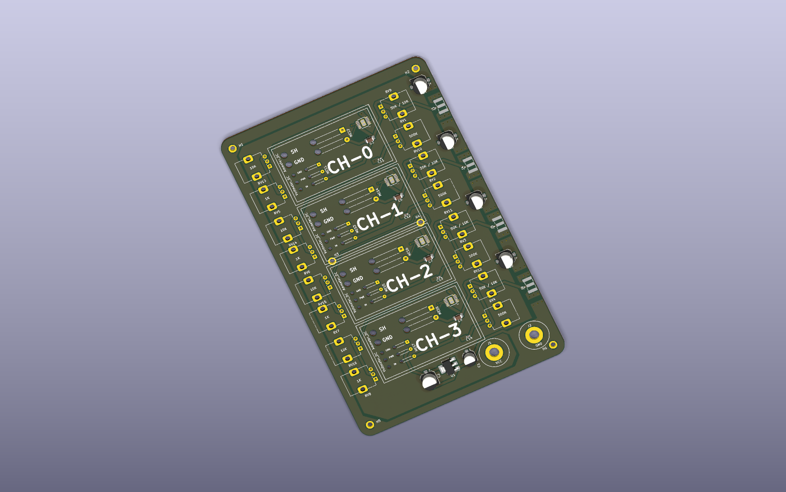
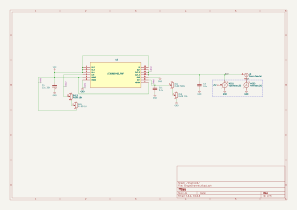

**Автор: Владислав Чернухин** · [Инженерное портфолио](https://github.com/TzarRusi)

Специализированная четырёхканальная плата отрицательного питания для лабораторных задач. Мой вклад — разработка схемотехники и топологии платы на LT3090. В репозитории собраны редактируемые исходники, схема, BOM и материалы конструктива.

## Фотография платы

Фото платы с маркировкой HP V0.1, до монтажа компонентов. Разводка отличается от архивной CAD-ревизии, представленной ниже.

## CAD-ревизия

Рендер из исходного файла KiCad. Это визуализация PCB; часть компонентов не имеет подключённых 3D-моделей.

## Устройство

| Узел | Реализация в проекте |
|---|---|
| Каналы | 4 повторяемых иерархических листа Channel0–Channel3 |
| Регулятор | LT3090EMSE_PBF, корпус MSOP-12 с теплоотводящей площадкой |
| Настройка | Потенциометры в каждом канале |
| Контроль | Подключения внешних вольтметров и амперметров |
| Выходы | 4 коаксиальных разъёма SMA |
| PCB | 2 медных слоя; толщина платы в исходнике 1,57 мм |
| Конструктив | STEP-модели платы и исходники деталей/сборок SolidWorks |

## Схемы и разводка

[Общая схема](NegativeVoltageModule.svg) · [Схема одного канала](NegativeVoltageModule-Channel0.svg) · [Верхний слой PCB](pcb-top.svg)

## Открыть проект

1. Скачайте репозиторий целиком и откройте `NegativeVoltageModule.kicad_pro` в KiCad (исходный формат — KiCad 7; просмотр и экспорт проверены в KiCad 10).
2. Для редактирования библиотечных компонентов распакуйте `custom-library.zip` **в корень репозитория**, сохранив структуру. В архиве находятся локальные таблицы библиотек и посадочное место; символ LT3090 уже включён в репозиторий.
3. Если старые 3D-ссылки не разрешаются, задайте `KICAD6_3DMODEL_DIR` на каталог стандартных 3D-моделей установленного KiCad.
4. Конструктив находится в `mechanical-source.zip`. Для сборок SolidWorks может потребоваться переуказание ссылок на файлы деталей и платы.

| Файлы | Содержание |
|---|---|
| `*.kicad_pro`, `*.kicad_pcb`, `*.kicad_sch` | Проект, плата и иерархическая схема |
| `NegativeVoltageModule.csv` | Исходный BOM; разделитель `;` |
| `LT3090EMSE_PBF.kicad_sym`, `MSOP-12_MSE.kicad_mod` | Пользовательский символ и посадочное место |
| `custom-library.zip` | Локальная конфигурация библиотек для переноса проекта |
| `mechanical-source.zip` | STEP, SLDPRT и SLDASM |
| `manufacturing-review.zip` | Gerber, Excellon Drill, позиции компонентов и BOM для инженерной проверки |
| `VERIFICATION.md` | Результаты проверки и границы готовности |

## Статус

Опубликована архивная ревизия разработки. Схемы и PCB открываются и экспортируются; при DRC в KiCad 10 обнаружены замечания к зонам и термобарьерам. Производственные экспорты приложены **для проверки**, перед заказом платы необходимо закрыть замечания DRC и согласовать файлы с производством. Измеренные диапазоны напряжения, токи и шумы в этом архиве не зафиксированы и здесь не заявляются.

Справочная документация: [LT3090 — Analog Devices](https://www.analog.com/en/products/lt3090.html). Параметры микросхемы не следует приравнивать к измеренным параметрам всей платы.
